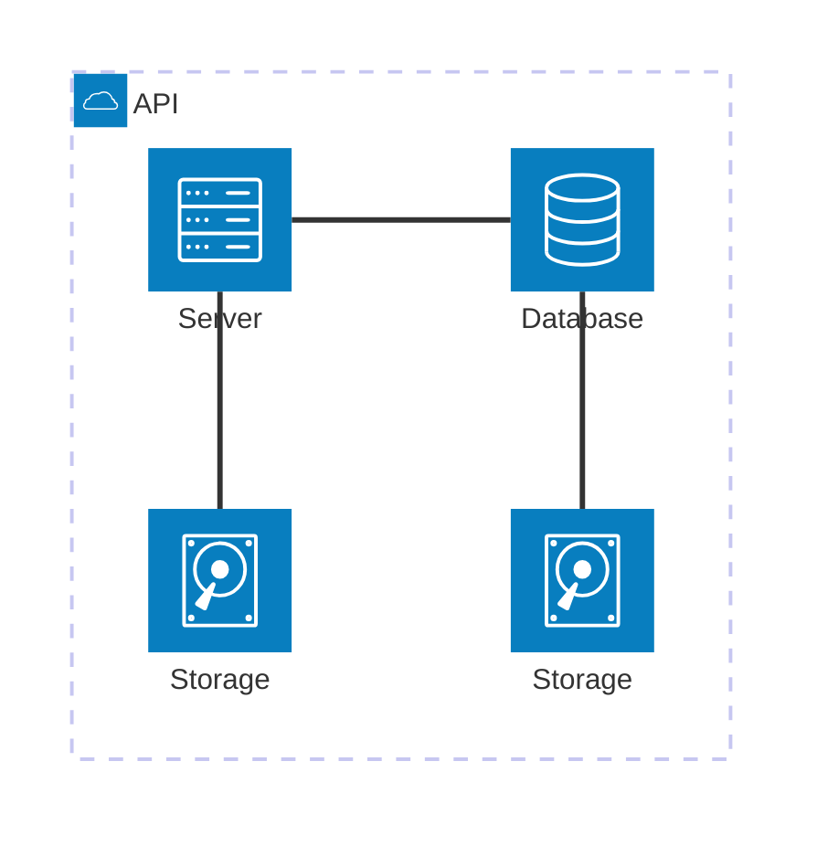
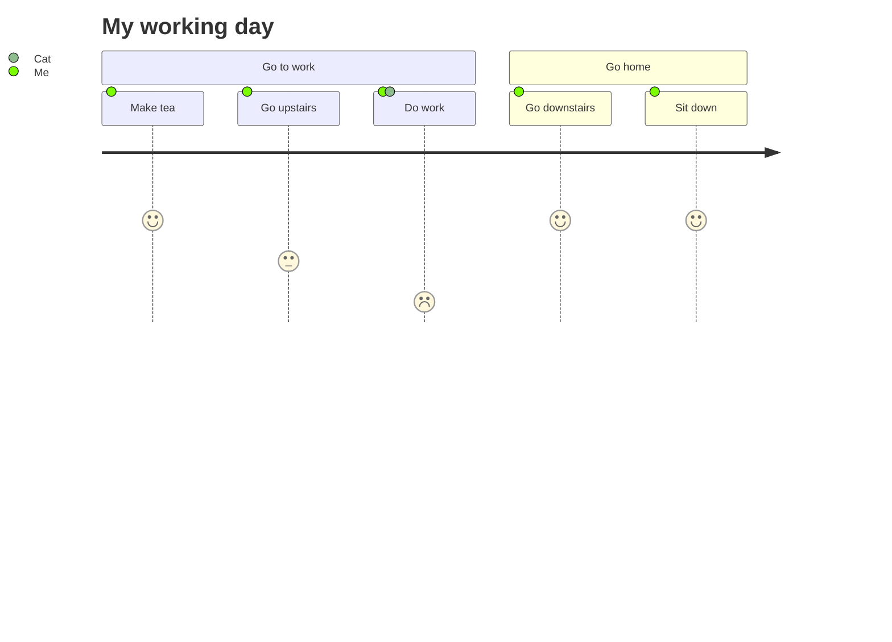
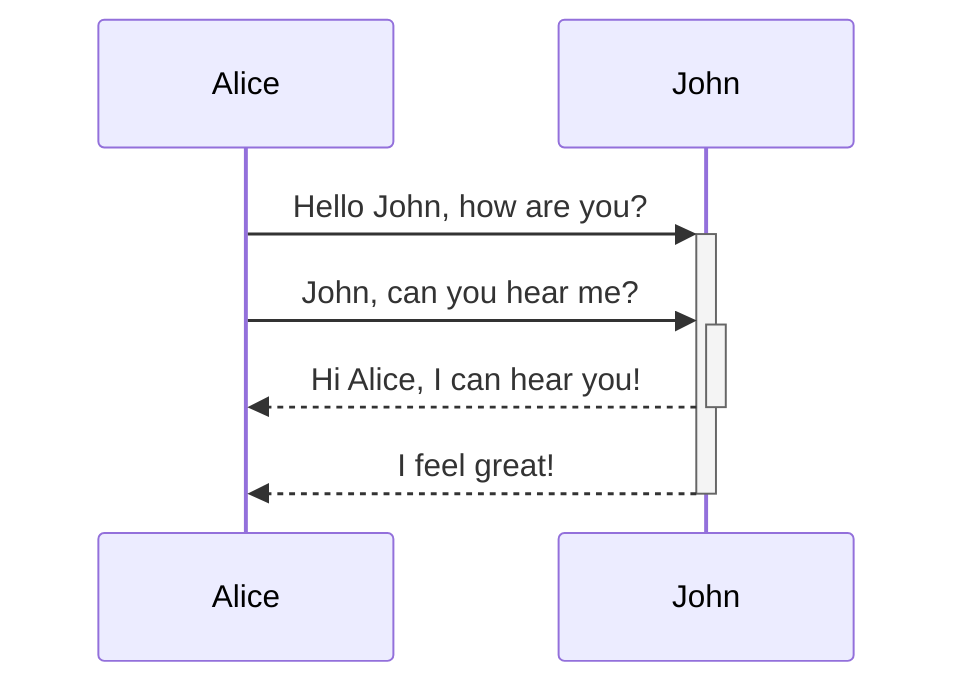
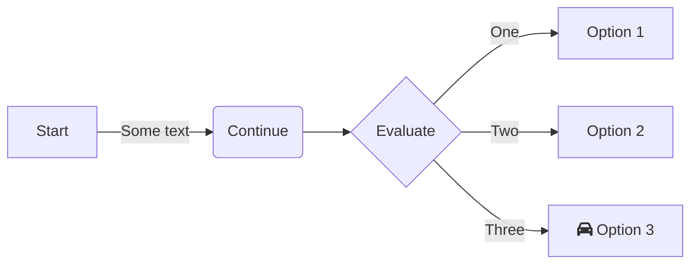
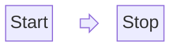
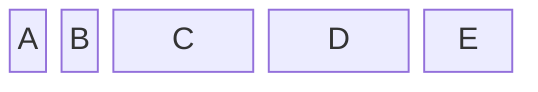

# 🧠 Smart Diagram

# AI Diagram Generator


## Overview

**AI Diagram Generator** is an intelligent diagram generation tool that uses advanced Large Language Models (LLMs) to create, manage, and visualize Mermaid.js diagrams from multiple input modalities. It transforms natural language descriptions—whether typed, spoken, or uploaded—into clear, structured diagrams instantly.

The core of the tool is its versatile input system, designed for flexibility and ease of use:

*   **Text/README Input:** Directly paste or type descriptions, notes, or existing documentation to generate corresponding diagrams.
*   **Voice Recording:** Describe your diagram idea conversationally using your microphone for hands-free creation.
*   **Upload Audio:** Provide existing audio files (e.g., from a meeting or brainstorm), and the tool will transcribe and convert the content into a diagram.

This project empowers users to quickly generate a wide array of diagrams (flowcharts, sequence diagrams, class diagrams, etc.) and supports full CRUD (Create, Read, Update, Delete) operations for comprehensive diagram lifecycle management, from initial concept to final version control.

## Features

*   **Multi-Modal Input:** Generate diagrams from text, voice, or audio files.
*   **Diagram Variety:** Supports entity relationship diagrams, architecture diagrams, sequence diagrams, block diagrams, requirement diagrams, user journeys, and flowcharts via Mermaid.js.
*   **Full CRUD Operations:** Create, view, edit, and delete your diagrams with ease.
*   **Lifecycle Management:** Manage the entire lifecycle of your diagrams, including versioning and history.
*   **Real-Time Preview:** See your diagram update in real-time as you modify the description.
*   **Export & Share:** Export diagrams as PNG, SVG, or shareable links.

## Getting Started

### Prerequisites

*   Node.js
*   npm or yarn
*   MongoDB Atlas account

### Installation

#### Backend Setup (/smart-diagrams-be)

1.  Navigate to the backend directory:
    ```bash
    cd smart-diagrams-be
    ```

2.  Install dependencies:
    ```bash
    npm install
    ```

3.  Set up environment variables:
    Create a `.env` file in the backend directory with the following variables (use your actual credentials):
    ```env
    DB_CONNECTION_STRING=your_mongodb_connection_string
    DEEPSEEK_API_URL=your_deepseek_api_url
    DEEPSEEK_API_KEY=your_deepseek_api_key
    FRONTEND_BASE_URL=your_frontend_url
    JWT_SECRET_KEY=your_jwt_secret
    LINKEDIN_CLIENT_ID=your_linkedin_client_id
    LINKEDIN_CLIENT_SECRET=your_linkedin_client_secret
    PORT=8090
    REDIRECT_URL=your_redirect_url
    OPENAI_API_KEY=your_openai_api_key
    ```

4.  Start the backend server:
    ```bash
    nodemon index.js
    ```
    The backend will run on `http://localhost:8090`

#### Frontend Setup (/smart-diagrams)

1.  Navigate to the frontend directory:
    ```bash
    cd smart-diagrams
    ```

2.  Install dependencies:
    ```bash
    npm install
    ```

3.  Set up environment variables:
    Create a `.env` file in the frontend directory with the following variables:
    ```env
    NEXT_PUBLIC_CLIENT_ID=your_linkedin_client_id
    NEXT_PUBLIC_BASE_URL=http://localhost:8090
    ```

4.  Start the frontend development server:
    ```bash
    npm run dev
    ```
    The frontend will run on `http://localhost:3000`

5.  Open your browser and visit `http://localhost:3000` to use the application.

## Usage

1.  **Select Input Method:** Choose between "Text/README", "Voice Recording", or "Upload Audio".
2.  **Provide Input:**
    *   For **Text**: Type or paste your diagram description in the text area.
    *   For **Voice**: Click the microphone button and start speaking.
    *   For **Audio**: Click "Upload Audio" and select your audio file.
3.  **Generate:** Click the "Generate Diagram" button.
4.  **View & Edit:** The generated Mermaid diagram will be displayed. You can further edit the description or the generated Mermaid code directly.
5.  **Manage:** Use the CRUD operations to save, update, or delete your diagrams.

## Supported Diagram Types

*   erDiagram (Entity Relationship Diagram)
*   architecture (Architecture Diagram)
*   sequenceDiagram (Sequence Diagram)
*   blockDiagram (Block Diagram)
*   requirement (Requirement Diagram)
*   journey (User Journey Map)
*   flowchart (Flowchart)

## Technology Stack

*   **Frontend:** React, Next.js
*   **Backend:** Node.js, Next.js API Routes
*   **AI:** OpenAI, Deepseek
*   **Diagramming:** Mermaid.js
*   **Styling:** Tailwind CSS
*   **Database:** MongoDB


## 🚀 Recent Updates

- **Grouping Components** – Architecture diagrams now support nested group nodes with drag-to-parent workflows and a toolbar button for inserting child groups. Groups are resizable via `NodeResizer`, and child positions are stored relative to their parent for precise layouts.
- **Editable Connections** – Edges can be created, reconnected, deleted, and restyled (Bezier, Straight, Step, SmoothStep) directly on the canvas while the backing Mermaid code stays perfectly in sync.
- **Custom Shapes & Styling** – Service and group nodes use enriched AWS-style cards, icons, hover states, and drop shadows so pasted Mermaid snippets render with a consistent, professional aesthetic.
- **Interactive Connections** – Connection previews snap to nearby handles, and edge styling (color, dash, arrow) updates live, making it easy to route and highlight flows.
- **Positioning Bug Fix** – Addressed the legacy positioning issue so imported elements now respect their group bounds; services appear inside the correct container instead of drifting outside.


---

## ✨ Features
- **AI-Powered Generation**: Convert natural language descriptions into accurate Mermaid diagram code using advanced LLMs
- **Full CRUD Support**: Create, read, update, and delete diagrams with intuitive operations
- **Multiple Diagram Types**: Support for ER diagrams, Sequence diagrams, Block diagrams, Requirement diagrams, User Journey maps, Architecture diagram and Flowcharts
- **Dual View Display**: Simultaneously view both the generated Mermaid code and rendered diagram visualization
- **Export & Save**: Export diagrams as PNG, SVG, or raw Mermaid code for integration with other tools
- **Version History**: Track changes and revisions to diagrams over time
- **Real-time Preview**: Instant visualization of diagram changes as you edit

---

## 🧱 Architecture Diagram




  ## 📋 Requirements Diagram

  ```mermaid
requirementDiagram

    requirement test_req {
    id: 1
    text: the test text.
    risk: high
    verifyMethod: test
    }

    functionalRequirement test_req2 {
    id: 1.1
    text: the second test text.
    risk: low
    verifyMethod: inspection
    }

    performanceRequirement test_req3 {
    id: 1.2
    text: the third test text.
    risk: medium
    verifyMethod: demonstration
    }

    interfaceRequirement test_req4 {
    id: 1.2.1
    text: the fourth test text.
    risk: medium
    verifyMethod: analysis
    }

    physicalRequirement test_req5 {
    id: 1.2.2
    text: the fifth test text.
    risk: medium
    verifyMethod: analysis
    }

    designConstraint test_req6 {
    id: 1.2.3
    text: the sixth test text.
    risk: medium
    verifyMethod: analysis
    }

    element test_entity {
    type: simulation
    }

    element test_entity2 {
    type: word doc
    docRef: reqs/test_entity
    }

    element test_entity3 {
    type: "test suite"
    docRef: github.com/all_the_tests
    }


    test_entity - satisfies -> test_req2
    test_req - traces -> test_req2
    test_req - contains -> test_req3
    test_req3 - contains -> test_req4
    test_req4 - derives -> test_req5
    test_req5 - refines -> test_req6
    test_entity3 - verifies -> test_req5
    test_req <- copies - test_entity2

  ```
## 🧭 User Journey Map Diagram



## 🔄 Sequence Flow Diagram



## 📊 Flowchart Diagram



## 🏗️ Block-diagram Diagram





## 🏗️ ER Diagram

```mermaid
erDiagram
    CUSTOMER }|..|{ DELIVERY-ADDRESS : has
    CUSTOMER ||--o{ ORDER : places
    CUSTOMER ||--o{ INVOICE : "liable for"
    DELIVERY-ADDRESS ||--o{ ORDER : receives
    INVOICE ||--|{ ORDER : covers
    ORDER ||--|{ ORDER-ITEM : includes
    PRODUCT-CATEGORY ||--|{ PRODUCT : contains
    PRODUCT ||--o{ ORDER-ITEM : "ordered in"


  ```

## Technology Stack

*   **Frontend:** React, Next.js
*   **Backend:** Node.js, Next.js API Routes
*   **AI:** OpenAI GPT-4, Whisper
*   **Diagramming:** Mermaid.js
*   **Styling:** Tailwind CSS
*   **Database:** PostgreSQL / MongoDB


## Smart Diagram — Frontend

This README explains the frontend layer of **Smart Diagram**, focusing on how **React Flow** is used to visualize and manage Mermaid-based diagrams. It provides a conceptual understanding without deep implementation details or code examples.

---

## 1. Overview

The frontend application serves as the visual interface for generating, editing, and managing diagrams created from Mermaid code. It leverages **React Flow** to render interactive diagrams and ensure a smooth synchronization between Mermaid textual descriptions and their graphical representations.

Users can interact with diagrams through drag-and-drop, CRUD actions, and live updates that reflect changes in both the Mermaid code and visual layout.

---

## 2. Key Objectives

* Provide an intuitive visual representation of Mermaid code.
* Maintain a two-way synchronization between Mermaid text and rendered diagrams.
* Support CRUD operations on diagrams (Create, Read, Update, Delete).
* Offer real-time visualization and editing capabilities.
* Enable exporting and sharing of diagrams for collaboration.

---

## 3. Role of React Flow

**React Flow** is the central tool for diagram rendering and interaction. It allows nodes, edges, and relationships defined in Mermaid syntax to be represented as interactive, editable elements.

React Flow is used to:

* Convert Mermaid-defined elements into visual nodes and connections.
* Render dynamic diagrams that users can interact with (move, edit, or delete elements).
* Reflect any changes back to the underlying Mermaid code structure.
* Manage layout updates and maintain diagram consistency.

Essentially, React Flow acts as the **visual bridge** between raw Mermaid code and user-friendly graphical diagrams.

---

## 4. Mermaid and React Flow Relationship

The system maintains a **bi-directional relationship**:

* **From Mermaid to Diagram**: The Mermaid text is parsed and converted into a structured data model that React Flow uses to display diagrams.
* **From Diagram to Mermaid**: Any modification made to the visual diagram (such as node repositioning or label editing) updates the underlying Mermaid code automatically.

This ensures both representations stay in sync at all times.

---

## 5. CRUD Operations

The frontend supports full diagram lifecycle management:

* **Create**: Generate new diagrams from text, voice, or audio input.
* **Read**: Load and view previously created diagrams.
* **Update**: Modify diagrams visually or through Mermaid code.
* **Delete**: Remove unwanted diagrams from the system.

All CRUD actions are seamlessly integrated into the user interface, with real-time updates and persistent backend storage.

---

## 6. User Interaction Flow

1. The user inputs text, voice, or audio that is converted to Mermaid code by the backend.
2. The Mermaid code is rendered visually using React Flow.
3. Users can interact with the diagram — add, edit, move, or delete elements.
4. Changes are synchronized with the stored Mermaid code.
5. Users can export, share, or save the final diagram.

---

## 7. Technology Stack (Frontend)

* **Framework**: React + Next.js
* **Visualization**: React Flow
* **Diagram Syntax**: Mermaid.js
* **Styling**: Tailwind CSS
* **API Communication**: Axios
* **State Management**: React hooks

---

## 8. Integration Summary

The frontend’s primary responsibility is to visualize and manage diagrams generated from AI or manual input. React Flow is the visualization core, providing flexibility, interactivity, and scalability for diagram manipulation.

This approach ensures that **non-technical users** can visually understand and edit Mermaid-based diagrams without needing to modify code manually, while **technical users** can still access and edit the underlying Mermaid syntax directly.

---

## 9. Conclusion

React Flow enhances the Smart Diagram frontend by transforming static Mermaid code into interactive, editable diagrams. Its integration ensures smooth two-way synchronization between code and visuals, enabling efficient diagram creation, modification, and lifecycle management within the Smart Diagram ecosystem.

---

# LLM Integration & Diagram Generation

## Smart Diagram — Backend

This README explains the backend layer of **Smart Diagram**, focusing on how **AI models (OpenAI & DeepSeek)** are used to generate, transcribe, and manage Mermaid-based diagrams.  
It provides a clear, structured overview without code examples.

---

## 1. Overview

The backend is the **AI-powered engine** of Smart Diagram.  
It processes user inputs (text, audio, or existing Mermaid code), communicates with AI models, and outputs validated MermaidJS code for frontend visualization.

Responsibilities include:

- Input processing (text, audio, Mermaid code)  
- AI diagram generation and validation  
- Data storage and management  
- API communication with the frontend  
- Diagram lifecycle management (CRUD operations)  

---

## 2. Key Objectives

- Convert natural language or audio inputs into MermaidJS diagrams using AI.  
- Provide validated and consistent Mermaid code to the frontend.  
- Support multiple AI models: **OpenAI GPT-4** and **DeepSeek Chat**.  
- Ensure accurate transcription for audio input via **OpenAI Whisper**.  
- Enable full CRUD operations for diagrams.

---

## 3. Role of the Backend

The backend serves as the **intelligent intermediary** between the frontend and AI systems.  

It:

- Accepts user inputs (text, voice, or Mermaid code)  
- Uses AI models to interpret or generate diagrams  
- Cleans and validates Mermaid syntax  
- Stores diagrams and metadata in the database  
- Provides RESTful APIs for frontend integration  

The backend ensures every AI-generated diagram is **accurate, consistent, and ready for visualization**.

---

## 4. AI Workflow and Logic

The backend follows a structured pipeline:

1. **Input Reception** – Receive text, audio, or Mermaid code.  
2. **Transcription (if audio)** – Convert speech to text using OpenAI Whisper.  
3. **Prompt Construction** – Build system prompts with strict Mermaid syntax rules.  
4. **AI Processing** – Generate diagrams using OpenAI GPT-4 or DeepSeek Chat.  
5. **Validation** – Clean and verify MermaidJS code.  
6. **Storage** – Save final diagrams with metadata in MongoDB.

---

## 5. Mermaid Code Validation

- **Cleaning** – Removes Markdown wrappers and unwanted formatting.  
- **Syntax Correction** – Ensures proper Mermaid directives (`flowchart TD`, `sequenceDiagram`, etc.).  
- **Fallbacks** – Generates a default diagram structure if AI output is invalid.

---

## 6. CRUD Operations

The backend supports full diagram lifecycle management:

- **Create** – Generate and store new diagrams.  
- **Read** – Retrieve stored diagrams for display or editing.  
- **Update** – Modify existing diagrams.  
- **Delete** – Remove diagrams permanently.

All operations are RESTful and integrate seamlessly with the frontend.

---

## 7. Data Management

Diagrams are stored in **MongoDB** with a structured data model (`FlowChart`), including:

- Title and diagram type  
- Input method (text, audio, Mermaid code)  
- Selected AI model (OpenAI or DeepSeek)  
- Transcribed text for audio input  
- Generated Mermaid code  
- User ID and metadata  

This ensures secure, organized, and accessible diagram storage.

---

## 8. Integration with Frontend

1. Frontend sends user input to the backend.  
2. Backend transcribes (if needed), generates, and validates Mermaid code.  
3. Cleaned Mermaid code is returned to the frontend.  
4. Frontend visualizes diagrams using **React Flow**.  
5. User edits are synced back to the backend via APIs.

---

## 9. Technology Stack (Backend)

- **Framework**: Node.js + Express.js  
- **Database**: MongoDB with Mongoose  
- **AI Models**: OpenAI GPT-4, DeepSeek Chat  
- **Audio Processing**: OpenAI Whisper  
- **API Communication**: Axios  
- **File Handling**: Multer  
- **Environment Management**: dotenv  

---

## 10. Security and Environment

- Sensitive credentials stored in environment variables (`.env`).  
- All AI communications are HTTPS with authorized Bearer tokens.  
- Ensures data privacy and secure integration with AI services.

---

## 11. Conclusion

The backend is the **intelligent core** of Smart Diagram, transforming text or audio inputs into structured MermaidJS diagrams.  
It combines AI transcription, generation, syntax validation, and database storage to deliver **reliable, interactive diagrams** for the frontend.

---
